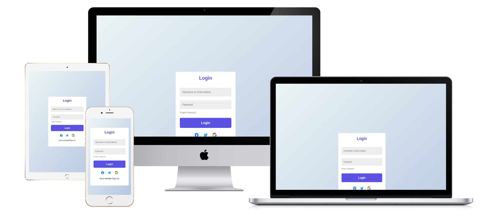

  

# Login-signup-form
This project is a responsive and secure Login/Signup form designed to provide users with a seamless and intuitive authentication experience. Whether you're logging in to access your dashboard or signing up to join a community, this form ensures simplicity, efficiency, and security.

- [Features](#features)
  - [Getting Started](#getting-started)
  - [Usage](#usage)
  - [Setup](#setup)
  - [Overview](#overview)
  - [Links](#links)
  - [Built with](#built-with)
  - [Live Demo](#-live-demo)
  - [Continued development](#continued-development)
  - [Author](#author)
  - [Contributing](#-contributing)
  - [Show your support](#show-your-support)
  - [Acknowledgments](#acknowledgments)
  - [ Why this is Special](#why-is-kamals-kitchen-magic-special)
  - [License](#-license)

## 🌟 Features

- **User Authentication**: Users can sign up for an account by providing their email and password or log in if they already have an account.
- **Real-Time Validation**: The form checks the input as the user types, ensuring that email formats and passwords meet specific criteria, such as minimum length and character requirements.
- **Password Strength Indicator**: Visual feedback to help users create a stronger password by showing the strength (weak, medium, strong) based on criteria like length and character variety.
- **Responsive Design**: The form is fully responsive, adjusting to different screen sizes and providing an optimized experience for mobile and desktop users.
- **Error Handling**: Clear error messages are displayed if the user submits incorrect or incomplete data, such as an invalid email address or password mismatch.
- **Password Recovery**: A link to reset a forgotten password, providing a secure process for users to regain access to their accounts.
- **Secure Authentication**: Designed to integrate with backend services (e.g., Firebase, Node.js) to store user credentials securely.

### Getting Started

To get a local copy up and running follow these simple steps.

Prerequisites
VIsual Studio Code.
A Web Browser (preferably Brave)

### Setup

Clone the GitHub Repository

- git clone "https://github.com/RomeesaKamal/Login-signup-form.git"

### Usage

Start your server by clicking Go Live

## Overview

The Login/Sign-Up Form is a secure and user-friendly authentication system designed for web applications. This form allows users to create an account (sign-up) or log into an existing account (login) to access personalized content or features. Built with HTML, CSS, and JavaScript, this project focuses on providing a simple yet secure way for users to authenticate themselves.

The form includes both login and sign-up functionality, with real-time validation to ensure that users provide the correct information, such as a valid email format and secure password. This authentication system can be easily integrated into any website or web application that requires user access control.

The form is designed to be responsive, working seamlessly across desktop and mobile devices. With a clean, minimalistic design and smooth user experience, it provides an intuitive process for users to register and access their accounts.

### Links

- Solution URL: [ solution URL here](https://github.com/RomeesaKamal/Login-signup-form)
- Live Site URL: [ live site URL here](https://romeesakamal.github.io/Login-signup-form/)

## Built With

**HTML/CSS & JS best practices:** Correct use of tags, elements, properties and syntax.

**GitHub flow:** Correct use of Branches for deployment and features development.

## 🌎 Live Demo:

- [Live Demo Link](https://romeesakamal.github.io/Login-signup-form/)

## Continued Development
This project is continuously being enhanced, with the following planned updates and features:

### Planned Featur

- **Two-Factor Authentication (2FA)****: Add an extra layer of security by implementing two-factor authentication via SMS or email for more secure user sign-ins.

- **Social Media Login**: Enable users to log in using their existing social media accounts (e.g., Google, Facebook, Twitter) for faster and more convenient sign-in.

- **Account Management**: Implement features that allow users to update their profiles, change their passwords, and delete accounts.

- **Login/Sign-Up Animations**: Improve the user experience with smooth animations during transitions between the login and sign-up forms.

- **Remember Me**: Add a "Remember Me" option for users to stay logged in across sessions, reducing the need to log in every time.

### Improvements:

- **Mobile Optimization**: Further enhance the design for smaller screens, ensuring users can easily interact with the form on mobile devices.

- **Accessibility Enhancements**: Ensure the form is fully accessible, with proper contrast, keyboard navigation, and screen reader support.

- **Backend Integration**: Integrate the form with backend authentication systems (e.g., Firebase, Node.js, or other server-side technologies) to securely handle login and sign-up requests.

- **Security Enhancements**: Implement additional security measures like encryption for passwords and security questions for password recovery.

### Bugs to Fix:

- **Error Message Clarity**: Improve the clarity of error messages, making it easier for users to understand what went wrong and how to fix it.

- **Session Management**: Ensure proper session handling and automatic logout after a period of inactivity to enhance security.

### Contribution Opportunities:
- If you’d like to contribute to the development of the Login/Sign-Up form, help integrate it with a backend service, or add any of the planned features, feel free to fork the repository and submit a pull request.

## Author

### 👤 **Romeesa Kamal**

- GitHub: [@kamalromeesa](https://github.com/RomeesaKamal/)
- Fronted Mentor: [@Romeesakamal](https://www.frontendmentor.io/profile/RomeesaKamal)
- Linkedin: [@Romeesakamal](https://www.linkedin.com/in/romeesa-kamal-7864b8342/)

## 🤝 Contributing

Contributions, issues, and feature requests are welcome!

Feel free to check the issues page.

## Show your support

Give a ⭐️ if you like this project!

## Acknowledgments

- Thanks to the [Mujeeb ur Rehman](https://github.com/Mujeeb4582/) for the great curriculum.
- Thanks to the Code Reviewer(s) for the insightful feedback.

## Why this is special:

- Beautiful design: Every detail has been thoughtfully crafted to make using the app a delightful experience.

- Super simple to use: With just a few clicks, you can manage your entire to-do list, helping you stay organized without the hassle.

- Persistent and reliable: You won’t have to worry about losing your tasks. The app saves them locally and automatically.

- With this version, you convey more excitement, highlight the beauty of the app, and encourage engagement and collaboration. Feel free to replace placeholder URLs with your actual demo GIFs or screenshots.

## 📝 License

This project is MIT licensed.

_NOTE: we recommend using the [MIT license](https://choosealicense.com/licenses/mit/) - you can set it up quickly by [using templates available on GitHub](https://docs.github.com/en/communities/setting-up-your-project-for-healthy-contributions/adding-a-license-to-a-repository). You can also use [any other license](https://choosealicense.com/licenses/) if you wish._

